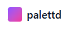

# palettd

Generate beautiful brand palette images (SVG/PNG) from a list of colors.

[](https://www.npmjs.com/package/palettd)
[](https://github.com/mpge/palettd/actions/workflows/ci.yml)
[](https://opensource.org/licenses/MIT)

palettd takes your colors and outputs a beautiful "brand guidelines" style palette board image. Perfect for design documentation, style guides, and brand assets.

<a href="https://palettd.com">
  
</a>

**Try the demo or use the free API for palette generation at [palettd.com](https://palettd.com)**

<br clear="left"/>

## Features

- **Multiple input formats**: hex (#RGB, #RRGGBB), rgb(), rgba(), hsl(), hsla()
- **SVG and PNG output**: Vector-first approach with high-quality PNG rasterization
- **Automatic color naming**: Deterministic, offline color naming using perceptual matching
- **Accessibility-aware**: Automatic text color selection for optimal contrast
- **Deterministic**: Same inputs always produce identical outputs
- **Zero network calls**: Works completely offline
- **Cross-platform**: Works on Windows, macOS, and Linux

## Example Output


Generated with:
```bash
palettd "#2D4A3E" "#8B4D57" "#D4A574" "#E8DCC4" "#1A1A2E" --title "Modern Earth"
```

## Installation

```bash
# Global install for CLI
npm install -g palettd

# Or use with npx
npx palettd "#FF6600" "#0B1320"

# Library install
npm install palettd
```

## CLI Usage

### Basic Usage

```bash
# Generate SVG to stdout
palettd "#FAF5E9" "#392525" "#683226" "#B25D3E"

# Generate PNG file
palettd "#FAF5E9" "#392525" "#683226" "#B25D3E" --format png --out palette.png

# Generate SVG file
palettd "#FAF5E9" "#392525" "#683226" "#B25D3E" --out palette.svg
```

### From JSON File

```bash
palettd --input colors.json --format png --out palette.png
```

Where `colors.json` contains:

```json
{
  "colors": ["#FAF5E9", "#392525", "#683226", "#B25D3E"],
  "names": {
    "#FAF5E9": "Alabaster",
    "#392525": "Cocoa"
  }
}
```

### All Options

```
OPTIONS
  Input/Output
    --input, -i <path>      Read colors from JSON file
    --format, -f <format>   Output format: svg (default) or png
    --out, -o <path>        Output file path
    --metadata <path>       Write layout metadata JSON to file

  Dimensions
    --width <n>             Canvas width (default: 640)
    --height <n>            Canvas height (default: 480)

  Colors
    --outer-bg <color>      Outer background color (default: #FFFFFF)
    --card-bg <color>       Card background color (default: #FAFAFA)
    --stroke <color>        Card stroke color (default: #E5E5E5)
    --stroke-opacity <n>    Stroke opacity 0-1 (default: 0.6)

  Layout
    --card-radius <n>       Card border radius (default: 12)
    --padding <n>           Card padding (default: 28)
    --gap <n>               Gap between swatches (default: 10)

  Typography
    --font <family>         Font family stack
    --footer-left <text>    Footer left text (default: PALETTE)
    --footer-center <text>  Footer center text
    --footer-right <text>   Footer right text (default: palettd)

  Display
    --show-hex              Show hex codes on swatches (default: true)
    --no-hex                Hide hex codes
    --show-name             Show color names (default: true)
    --no-name               Hide color names

  Naming
    --names <strategy>      auto (default), none, or provided
    --order <strategy>      input (default) or lch (sort by hue/lightness)
```

## Library API

### Quick Start

```typescript
import { generateBoard, generateSvg, generatePng } from 'palettd';

// Generate complete board result
const result = generateBoard(['#FAF5E9', '#392525', '#683226', '#B25D3E'], {
  format: 'png',
  title: 'Brand Colors',
});

// Access the output
console.log(result.svg);        // SVG string
console.log(result.png);        // PNG Buffer
console.log(result.palette);    // Color information
console.log(result.layout);     // Layout metadata

// Or generate just SVG/PNG
const svg = generateSvg(['#FF6600', '#0B1320']);
const png = generatePng(['#FF6600', '#0B1320']);
```

### Color Utilities

```typescript
import {
  normalizeColor,
  nameColor,
  computeTextColor,
  parseColor,
  getContrastRatio,
} from 'palettd';

// Normalize any color format to all representations
const color = normalizeColor('#FF6600');
console.log(color.rgba);   // { r: 255, g: 102, b: 0, a: 1 }
console.log(color.hex);    // "#FF6600"
console.log(color.hsla);   // { h: 24, s: 100, l: 50, a: 1 }
console.log(color.oklab);  // OKLab values
console.log(color.oklch);  // OKLCH values

// Get a human-friendly name
const name = nameColor(color, 'auto');
console.log(name); // "Safety Orange"

// Get optimal text color for a background
const textColor = computeTextColor('#2B1B1B');
console.log(textColor); // "#FFFFFF"

// Parse any color format
const rgba = parseColor('rgb(255, 102, 0)');
const rgba2 = parseColor('hsl(24, 100%, 50%)');

// Calculate contrast ratio
const ratio = getContrastRatio(
  { r: 0, g: 0, b: 0, a: 1 },
  { r: 255, g: 255, b: 255, a: 1 }
);
console.log(ratio); // 21
```

### Full API Reference

#### Main Functions

| Function | Description |
|----------|-------------|
| `generateBoard(colors, options)` | Generate complete board with SVG, PNG, layout, and palette |
| `generateSvg(colors, options)` | Generate SVG string only |
| `generatePng(colors, options)` | Generate PNG buffer only |

#### Color Functions

| Function | Description |
|----------|-------------|
| `normalizeColor(input)` | Parse and normalize any color format |
| `parseColor(input)` | Parse color string to RGBA |
| `nameColor(color, strategy)` | Get human-friendly color name |
| `nameColors(colors, strategy)` | Name multiple colors with deduplication |
| `computeTextColor(bgHex)` | Get optimal text color for background |
| `getContrastRatio(color1, color2)` | Calculate WCAG contrast ratio |
| `colorDistance(oklab1, oklab2)` | Calculate perceptual distance |

#### Layout Functions

| Function | Description |
|----------|-------------|
| `generateLayout(colorCount, options)` | Generate layout for N colors |
| `packColors(colors, options)` | Create palette with names and text colors |

#### Render Functions

| Function | Description |
|----------|-------------|
| `renderSvg(palette, layout, options)` | Render SVG from palette and layout |
| `renderPng(svg, options)` | Rasterize SVG to PNG |

### Types

```typescript
interface BoardOptions {
  format?: 'svg' | 'png';
  width?: number;
  height?: number;
  outerBg?: string;
  cardBg?: string;
  cardRadius?: number;
  padding?: number;
  gap?: number;
  stroke?: string;
  strokeOpacity?: number;
  font?: string;
  title?: string;
  footerLeft?: string;
  footerCenter?: string;
  footerRight?: string;
  showHex?: boolean;
  showName?: boolean;
  names?: 'auto' | 'none' | 'provided';
  providedNames?: Record<string, string>;
  order?: 'input' | 'lch';
}

interface BoardResult {
  svg: string;
  png?: Buffer;
  layout: Layout;
  palette: PaletteColor[];
}

interface NormalizedColor {
  input: string;
  rgba: RGBA;
  hex: string;
  hsla: HSLA;
  oklab: OKLab;
  oklch: OKLCH;
}

interface PaletteColor extends NormalizedColor {
  name: string;
  textColor: string;
  index: number;
}
```

## Examples

### Brand Palette

```bash
palettd "#FAF5E9" "#392525" "#683226" "#B25D3E" "#728383" "#3E4734" "#E3E890" "#B6B7A5" "#7E7B62" \
  --title "Autumn Collection" \
  --footer-left "STYLE GUIDE" \
  --footer-center "COLOR PALETTE" \
  --footer-right "2024" \
  --format png \
  --out brand-palette.png
```

### Minimal Palette

```bash
palettd "#000000" "#FFFFFF" \
  --no-name \
  --footer-left "" \
  --footer-center "" \
  --footer-right "" \
  --format svg \
  --out minimal.svg
```

### With Custom Names

```json
// colors.json
{
  "colors": ["#FF6600", "#0B1320", "#00A86B", "#FFD700"],
  "names": {
    "#FF6600": "Sunset Orange",
    "#0B1320": "Midnight",
    "#00A86B": "Jade",
    "#FFD700": "Golden Hour"
  }
}
```

```bash
palettd --input colors.json --names provided --format png --out custom-names.png
```

## How It Works

### Color Naming

palettd uses a curated dataset of ~200 named colors and finds the closest match using OKLab perceptual distance. For colors without a close match, it generates descriptive names based on hue family, lightness, and chroma (e.g., "Soft Olive", "Deep Violet Red").

### Layout Templates

The layout engine has optimized templates for 2-10 colors that create visually pleasing arrangements similar to professional brand guideline documents. For more than 10 colors, it uses a grid layout.

### Text Color Selection

Text colors are automatically selected based on WCAG contrast ratio calculations to ensure readability. Dark backgrounds get white text; light backgrounds get dark text.

## Requirements

- Node.js 20 or later

## Contributing

Contributions are welcome! Please feel free to submit a Pull Request.

1. Fork the repository
2. Create your feature branch (`git checkout -b feature/amazing-feature`)
3. Commit your changes (`git commit -m 'Add some amazing feature'`)
4. Push to the branch (`git push origin feature/amazing-feature`)
5. Open a Pull Request

### Development

```bash
# Install dependencies
npm install

# Run tests
npm test

# Run tests in watch mode
npm run test:watch

# Build
npm run build

# Lint
npm run lint

# Format
npm run format
```

## Credits

Design inspiration (with modifications) from [Radish Counseling Color Palette](https://dribbble.com/shots/26591010-Radish-Counseling-Color-Palette) by Mia Muse.

## License

MIT - see [LICENSE](LICENSE) for details.
